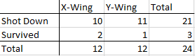

# Intro

In this project I desire to create a fusion of the materials that we have been studying in this class and a pop culture reference. 

In order to accomplish these goals, I will use the Death Star attack scene during the Battle of Yavin as seen in Star Wars: A New Hope – Episode 4. There are two scenarios I would like to demonstrate in using the events of this movie scene.


## What

In order to accomplish these goals, I will use the Death Star attack scene during the Battle of Yavin as seen in Star Wars: Episode IV - A New Hope. There are two scenarios (described below) I will use to  demonstrate concepts that have been learned in this class, and may be taught to other audiences.

## Why

Using pop culture references have the positive impact of generating interest in materials that may be otherwise limited or strained at best. It also, has the positive impact of using a well know scenario or scene that allows for the concepts being taught to be more easily digested and understood.

## How

First, we as the audience have it described to us before the Death Star attack from Wedge Antilles that the shot required to destroy the Death Star is “…impossible! Even for a computer.” to which Luke Skywalker replies “It's not impossible. I used to bullseye womp rats in my T-16 back home, they're not much bigger than two meters.” After the battle Han Solo exclaims “Great shot, kid. That was one in a million!” What we can determine from these lines of dialogue is that while not impossible, the shot that Luke took to successfully destroy the Death Star was incredibly difficult and should be expected as an extremely rare event. 

Second, I will demonstrate probabilities of survival by incorporating Bayes' Theorem and tree diagrams along the lines of the two squadrons that attacked the Death Star. Red Squadron was comprised strictly of X-Wing’s and Gold Squadron was comprised strictly of Y-Wings. Each squadron consists of 12 Starfighters each. I will use this data and the occurrences of the battle in order to demonstrate several scenarios and the probabilities associated with them. Will use RStudio to calculate and display findings.

# Body
In order to run this RMarkdown, the following files will need to be accessible:

DeathStarShot.csv

```{r}
DeathStarShot <- read.csv("DeathStarShot.csv")
```


StarfighterSurvival.png


# Topics From Class

R Studio
Data Representation
Data Analysis
Geometric Distribution
Binomial Distribution
Negative Binomial Distribution
Bernoulli Trials
Probability
Bayes' Theorem
Tree Diagrams

```{r setup, include=FALSE}
knitr::opts_chunk$set(echo = TRUE)
```

## Topic 1:
Here were will demonstrate R functions and means of analyzing data from the first scenario described.

First let us take a look at the data set demonstrating a "one in a million shot".

```{r}
#Just kidding this is a huge data set are we not going run this as a native visualization.
```

Notice that while not overly complex, the table does express one million cells to demonstrate 999,999 misses and 1 successful hit. The 0's representing FALSE or in this cases misses and the 1 representing TRUE, in this case a hit. Also note that RStudio deliberately modifies the scope of the representation due to the size.

Here are a few different functions within R that can be used to analyse the data set:


```{r}
#This shows the dimensions of the data set:

dim(DeathStarShot)

#This shows us the amount of variables found within the data set:

length(names(DeathStarShot))

#This shows us the range of the attempts that were made in the data set. In this scenario it is severely limited as we are simply looking for FALSE or TRUE statements:

range(DeathStarShot$`Hit or Miss`)


```


Lets use coding in R to confirm how many "hits" there are in the data set:


```{r}
Hit <- 1 == DeathStarShot$`Hit or Miss`
length(which(Hit))
```


Lets also use coding in R to determine how many "misses" there are:


```{r}
Miss <- 0 == DeathStarShot$`Hit or Miss`

length(which(Miss))

```


Lets demonstrate this data visually with the tools R gives us.


```{r}
#Scatterplot representation:

#plot(DeathStarShot$`Hit or Miss`, DeathStarShot$Attempts)

plot(DeathStarShot$Attempts, DeathStarShot$Hit.or.Miss)

```


```{r}
#Barplot representation:

barplot(DeathStarShot$Attempts, DeathStarShot$Hit.or.Miss)
```


```{r}
#Boxplot representation:

boxplot(DeathStarShot$Hit.or.Miss)
```

Because we are dealing with a "one in a million shot" scenario, this should immediately look odd compared to other data sets we have reviewed. For example here is a visualization of normal distribution, note the contrasts:

```{r}
x <- seq(-5, 5, length = 100)

y <- dnorm(x)

plot(x, y, type = 'l')

barplot(y)

boxplot(y)

```


## Topic 2:
In this next topic section lets explore concepts of geometric distribution and Bernoulli Trials:

```{r}
#First, lets calculate the probability of a "one in a million shot".

Prob <- 1 / 1000000
Prob

#In decimal form this is 0.000001. Which would then be 0.0001%

```

In the attack on the Death Star, there are three attempts to destroy the Death Star by shooting Proton Torpedoes down the exhaust port. First by Gold Leader, then Red Leader, and finally Red Five (Luke Skywalker).

```{r}
#What is the probability that Gold Leader successfully makes the shot?

dgeom(x = 1, prob = 0.000001)

#In decimal form this is 0.000000999999. Which would then be 0.0000999999%

#What is the probability the Red Leader successfully makes the shot?

dgeom(x = 2, prob = 0.000001)

#In decimal form this is 0.000000999998. Which would then be 0.0000999998%

#What is the probability the Red Five (Luke Skywalker) successfully makes the shot?

dgeom(x = 3, prob = 0.000001)

#In decimal form this is 0.000000999997 Which would then be 0.0000999997%
```

We can see that with each attempt the probability does improve, however, it is only minutely, and it should be appreciated how insanely difficult the feat was.

Lets look at this another way. Lets examine the probability of experiencing a specified amount of failures or less before we have a our first success.

```{r}
# Gold Leader

pgeom(q = 1, prob = 0.000001)


#The probability that the first shot would have been successful is 0.0001999999%

#Red Leader

pgeom (q = 2, prob = 0.000001)

#The probability that the shot would be successful in two or less shots is 0.0003999994%

#Red Five (Luke Sywalker)

pgeom (q = 3, prob = 0.000001)

#The probability that the shot would be successful in three or less shots is 0.0003999994%


#Lets say we had the entire Rebel Fleet to make an attempt, what probability would we find? Remember there were two squadrons, making a total of 24 Starfighters.

pgeom (q = 24, prob = 0.000001)

#The probability that the shot would be successful in 24 or less shots is 0.00249997%
```
Next, lets find the probability of having one successful hit with different trials on in this case, attempts:

```{r}
#Gold Leader

dbinom(x = 1, size = 1, prob = 0.000001)

#The probability of one success over one attempt is 0.0001%.

#Red Leader

dbinom(x = 1, size = 2, prob = 0.000001)

#The probability of one success over two attempts is 0.0001999998%.

#Red Five (Luke Skywalker)

dbinom(x = 1, size = 3, prob = 0.000001)

#The probability of one success over three attempts is 0.0002999994%.

#Rebel Fleet

dbinom(x = 1, size = 24, prob = 0.000001)

#The probability of one success over two attempts is 0.002399945%.
```

How many attempts (failures) would we need to try before we could expect a hit (success)?

```{r}
#Here lets run a test where we want to be 100% certain that the shot is successful:

qnbinom(1, size = 1, prob = 0.000001)

#Notice that the answer is "Inf" or infinity. This is such a difficult shot that we are being told there would need to be an infinite amount of tries.

#So lets modify the test so that we modify our certainty from 100% to 99%:

qnbinom(.99, size = 1, prob = 0.000001)

#Here we find that in order to be 99% certain that the first shot was a success, the pilot would need to make 4,605,167 attempts.

#Lets modify this once more to modify or certainty level from 99% to 99.9%:

qnbinom(.999, size = 1, prob = 0.000001)

#Notice the change? The shot is so difficult that just just the change pf 99% to 99.9% increases the amount of attempts from 4,605,167 to 6,907,751. A pilot would need an additional 2,302,584 attempts.

```


## Topic 3:

Here we will calculate the probabilities of survival through a few different exercises.


```{r, echo=FALSE, fig.align = "center", out.width="90%"}

```


First, let us explore what the chances of survival were regardless of the class of Starfighter flown during the Battle of Yavin. Here is the data will we be using in the subsequent exercises:

```{r, echo=FALSE, fig.align = "center", out.width="90%"}

```


```{r}
#There were a total of two squadrons, or 24 Starfighters as each squadron is made up of 12 Starfighters. Given that there were only three survivors between the Rebel squadrons we would calculate the probability of survival as:

Survival <- 3 / 24

Survival

#So we find that the probability of survival was 12.5%.

```


Next, lets compare the difference in probability of survival  based upon the class of Starfighter that was being flown:

```{r}
# Of Red Squadron, there were only two survivors. So to calculate the probability of survival across the Rebel fleet we would do the following:

XWingSurvival <- 2 / 24

XWingSurvival

#So we find that the probability of surviving the Battle of Yavin while flying an X-Wing was 8.3%.

#Of Gold Squadron, there was only one survivor:

YWingSurvival <- 1 / 24

YWingSurvival

#Therefore the probability of survival while flying a Y-Wing was 4.166667%.

```

## Topic 4:

Let's look at this another way using a tree diagram while using the principles of Bayes' Theorem.

```{r}
#The probability of being shot down in the Rebel fleet was the following:

ShotDown <- 21 / 24
ShotDown

#The probability of surviving was:

Surviving <- 3 / 24
Surviving

```

```{r}
#The probability of being shot down by a TIE Fighter pilot or a Turbolaser Turret was:

RedSqdSD <- 10 / 12
RedSqdSD

#The probability of being shot down in Gold Squadron was:

GoldSqdSD <- 11 / 12
GoldSqdSD

#The probability of surviving in Red Squadron was:

RedSqdSur <- 2 / 12
RedSqdSur

#The probability of surviving in Gold Squadron was:

GoldSqdSur <- 1 / 12
GoldSqdSur

```
 
Therefore, we can calculate the following probabilities via a tree diagram in R as such:

```{r}
SDRedSqd <- ShotDown * RedSqdSD

SDGoldSqd <- ShotDown * GoldSqdSD

SurRedSqd <- Surviving * RedSqdSur

SurGoldSqd <- Surviving * GoldSqdSur

SDRedSqd
SDGoldSqd
SurRedSqd
SurGoldSqd

```
This then allows us to answer the question of if a pilot survived the Battle of Yavin, what is the probability that they flew with Gold Squadron?

```{r}
ProbSur <- SurRedSqd + SurGoldSqd

ProbYWingSur <- SurGoldSqd / ProbSur

1 - ProbYWingSur

#We find that the probability that the surviving pilot flew with Gold Squadron was 66.66667%
```
As another example, let us find if a pilot was shot down, what is the probability that they flew with Red Squadron?

```{r}
ProbSD <- SDRedSqd + SDGoldSqd

ProbXWingSD <- SDRedSqd / ProbSD

1 - ProbXWingSD

#We find that the probability that the shot down pilot was with Red Squadron was 52.38095%
```

# Conclusion
